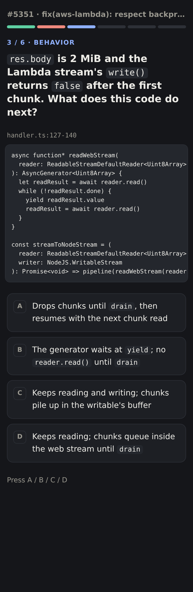
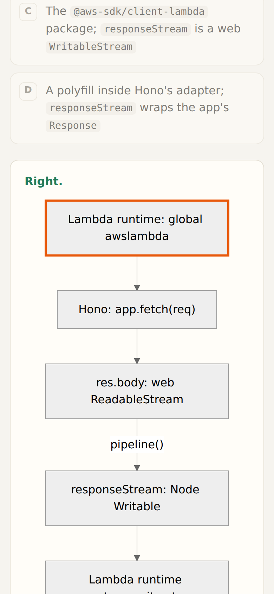

# pr-quiz

An agent skill for **Claude Code** and **Codex** that writes a short multiple-choice quiz about a pull request's code and posts it as one PR comment. AI-written code gets merged unread; the quiz makes the reviewer commit to answers about where the code runs, how it is wired, why it is shaped this way, how it behaves on a concrete scenario, and what it still gets wrong.

**[Play the demo →](https://macludde.github.io/pr-quiz/demo/)** It's a quiz on [honojs/hono#5351](https://github.com/honojs/hono/pull/5351). Here is [the PR comment it generates](docs/demo/comment.md).

<p>
  
  
</p>

## How it works

1. The agent reads the diff, every changed file at the head SHA and one hop of callers and callees.
2. It writes `quiz.json` with 5–7 questions. Every question needs a correct option, 2–3 distractors that a smart skimmer would believe, a Mermaid diagram showing why, a one-to-two sentence explanation, and line ranges that prove it.
3. `scripts/quiz.mjs` lints the quiz and fails it on any of these:
   - a required question kind is missing (runtime, architecture, decision or known issue);
   - the correct option gives itself away by being much longer than the distractors;
   - a cited line range doesn't exist at the SHA;
   - fewer than 75% of questions cite a file the PR changed;
   - a diagram doesn't render or is wider than 640 px.

   When the linter fails, the agent fixes the quiz, never the linter.
4. It renders a phone-friendly page and creates or updates a single PR comment with the answers folded away.

## Install

Requirements: Node 18+, `git`, and the [GitHub CLI](https://cli.github.com) (`gh auth login`). Playwright is optional. It render-checks the diagrams, and without it the linter warns and skips that check.

**Claude Code**

```bash
git clone https://github.com/Macludde/pr-quiz ~/.claude/skills/pr-quiz
cd ~/.claude/skills/pr-quiz && npm i && npx playwright install chromium
```

**Codex**

```bash
git clone https://github.com/Macludde/pr-quiz ~/.codex/skills/pr-quiz
cd ~/.codex/skills/pr-quiz && npm i && npx playwright install chromium
```

**Both, from one checkout**

```bash
git clone https://github.com/Macludde/pr-quiz ~/.agents/skills/pr-quiz
cd ~/.agents/skills/pr-quiz && npm i && npx playwright install chromium
mkdir -p ~/.claude/skills ~/.codex/skills
ln -s ~/.agents/skills/pr-quiz ~/.claude/skills/pr-quiz
ln -s ~/.agents/skills/pr-quiz ~/.codex/skills/pr-quiz
```

To update, run `git pull` in the checkout.

## Use

From a checkout of the repository, on a branch with an open PR:

- Claude Code: `/pr-quiz` or `/pr-quiz 123`, or just "quiz me on this PR".
- Codex: "use the pr-quiz skill on PR 123".

The skill only posts on PRs you ask about. Re-running it after a push edits the existing comment instead of adding a new one.

You can also drive the script by hand:

```bash
node scripts/quiz.mjs lint   quiz.json                 # checks only
node scripts/quiz.mjs render quiz.json [outDir]        # + quiz.md and quiz.html
node scripts/quiz.mjs post   quiz.json [--dry-run]     # + create or update the PR comment
```

## Hosting the page (optional)

The PR comment works on its own. If you want its **Play it →** link to open the interactive page on your phone, run the bundled server. It serves every rendered quiz behind a random token through a [Cloudflare quick tunnel](https://developers.cloudflare.com/cloudflare-one/connections/connect-networks/do-more-with-tunnels/trycloudflare/). Quick-tunnel URLs change on every restart, so the server also rewrites the link in comments it has already posted.

```bash
node scripts/serve.mjs --tunnel   # needs cloudflared; prints the public URL
```

As a systemd user service:

```ini
# ~/.config/systemd/user/pr-quiz.service
[Unit]
Description=PR quiz server + Cloudflare quick tunnel
Wants=network-online.target
After=network-online.target

[Service]
ExecStart=/usr/bin/node %h/.claude/skills/pr-quiz/scripts/serve.mjs --tunnel
Restart=on-failure

[Install]
WantedBy=default.target
```

```bash
systemctl --user enable --now pr-quiz
```

| Variable | Default | |
|---|---|---|
| `PR_QUIZ_HOME` | `~/.local/share/pr-quiz` | Where rendered quizzes, the token and the public URL live |
| `PR_QUIZ_PORT` | `8790` | Local port |
| `CLOUDFLARED` | `~/.local/bin/cloudflared` | `cloudflared` binary |
| `GH_BIN` | `/usr/bin/gh` | `gh` binary used to relink comments |

## Rebuilding the demo

The demo in `docs/demo/` is a normal render. `--home=../` points its "All quizzes" link at the landing page:

```bash
git clone https://github.com/honojs/hono /tmp/hono && cd /tmp/hono
git fetch origin main 267473b47d4bed1b4c95ddaf6bb5d0bfc8661c70
node <skill-dir>/scripts/quiz.mjs render <skill-dir>/docs/demo/quiz.json /tmp/out --home=../
cp /tmp/out/quiz.html <skill-dir>/docs/demo/index.html && cp /tmp/out/quiz.md <skill-dir>/docs/demo/comment.md
```
