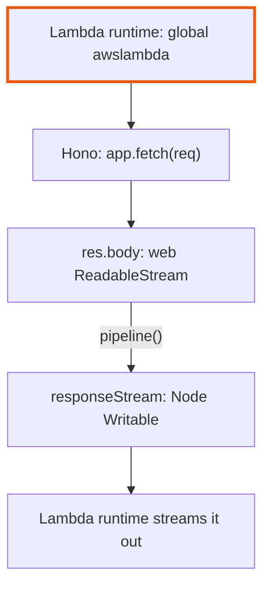
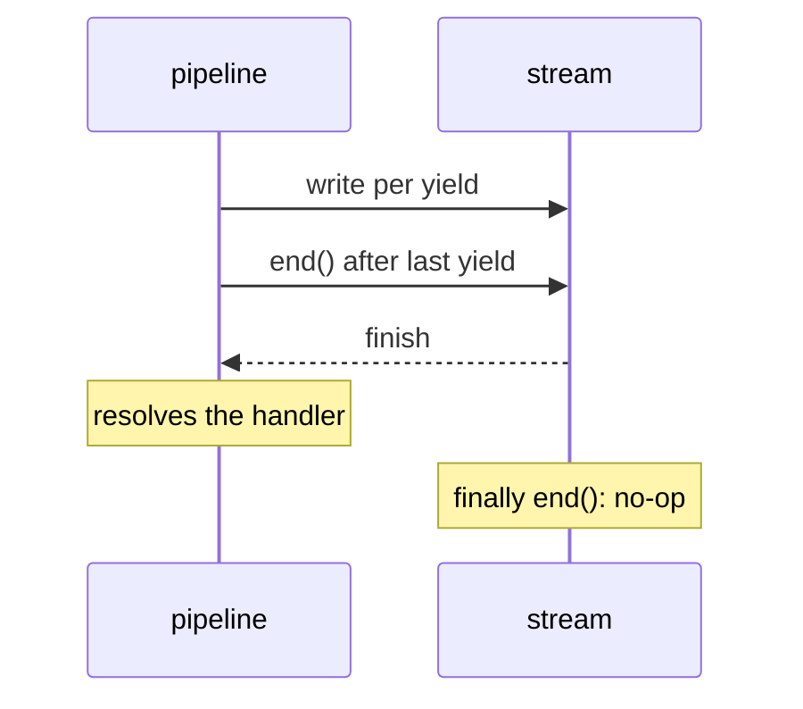
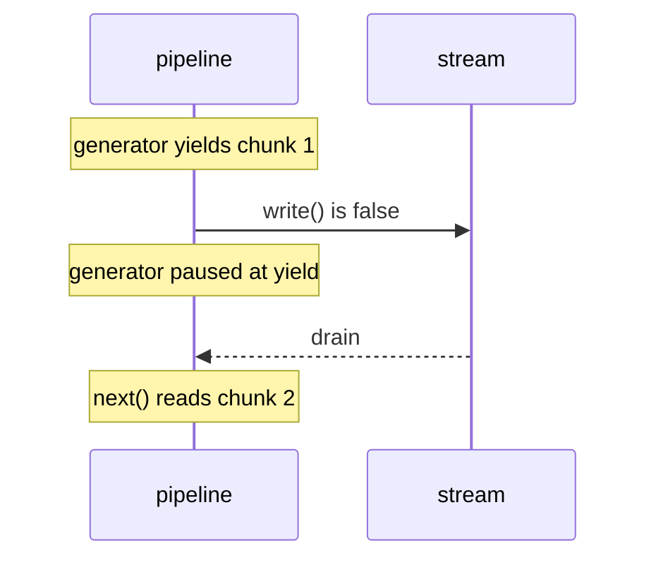
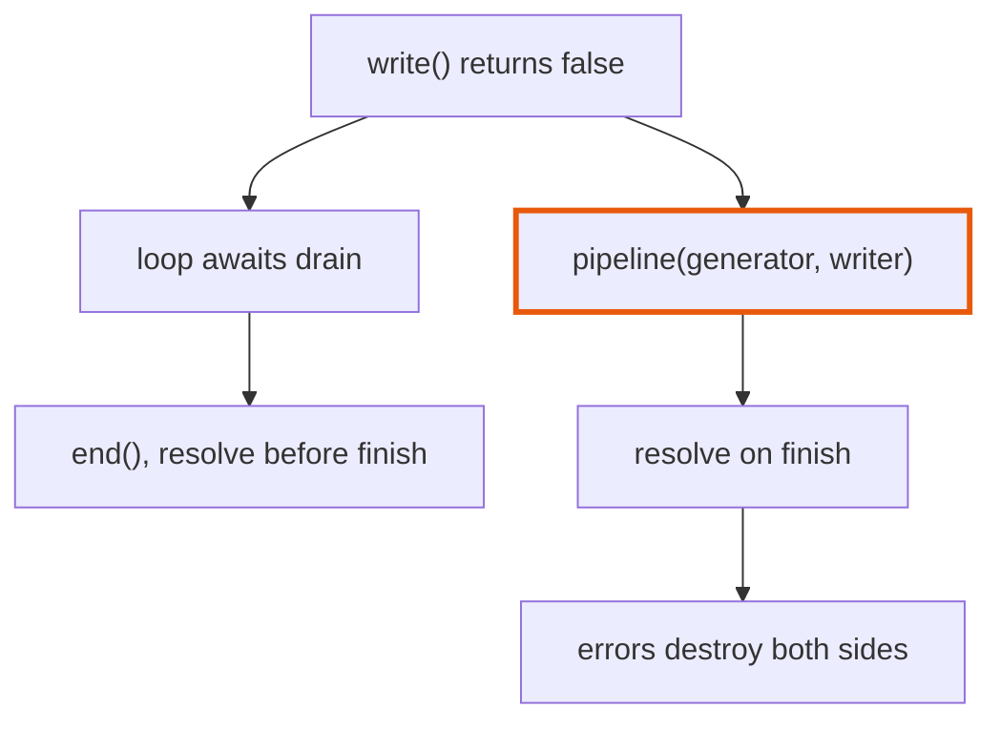
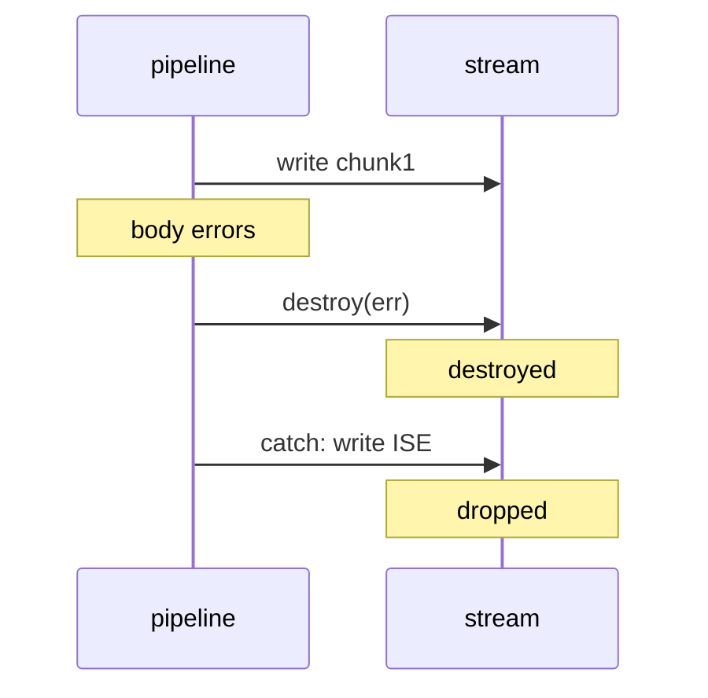
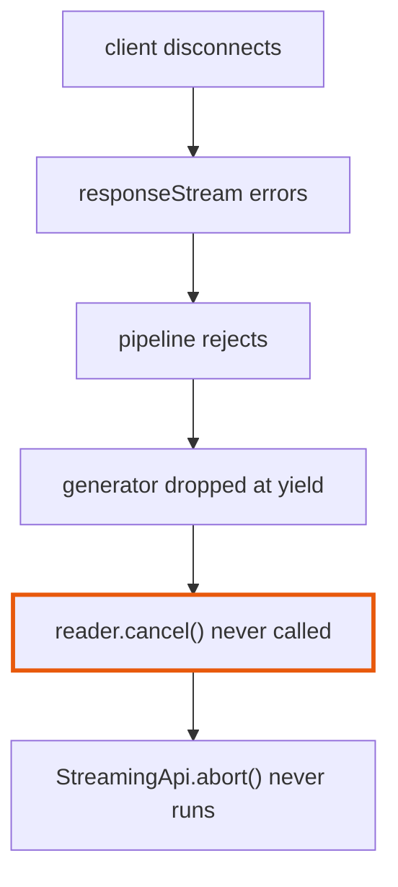

<!-- pr-quiz:v1 -->
## Quiz: do you own this PR?

6 questions · pick before you open the answer · <sub>267473b</sub>

---

#### 1 · Where it runs

**`streamHandle` calls `awslambda.streamifyResponse` without importing anything. What supplies `awslambda`, and what is `responseStream`?**

- **A.** A global from Lambda's Node runtime; `responseStream` is a Node `Writable`
- **B.** API Gateway injects it per request; `responseStream` is the raw TCP socket
- **C.** The `@aws-sdk/client-lambda` package; `responseStream` is a web `WritableStream`
- **D.** A polyfill inside Hono's adapter; `responseStream` wraps the app's `Response`

<details><summary><b>Answer</b></summary>

**A.** A global from Lambda's Node runtime; `responseStream` is a Node `Writable`



The Lambda Node runtime defines `awslambda` as a global and hands the handler a Node `Writable`; the test fakes both with `vi.stubGlobal`. That is why the body must be bridged from a web stream to a Node stream at all.

<sub>[`handler.ts:149-151`](https://github.com/honojs/hono/blob/267473b47d4bed1b4c95ddaf6bb5d0bfc8661c70/src/adapter/aws-lambda/handler.ts#L149-L151) · [`stream-backpressure.test.ts:6-13`](https://github.com/honojs/hono/blob/267473b47d4bed1b4c95ddaf6bb5d0bfc8661c70/runtime-tests/lambda/stream-backpressure.test.ts#L6-L13)</sub>

</details>

---

#### 2 · Architecture

**After this PR, a body finishes cleanly. Which call actually ends `responseStream`, and what does the `finally` block's `end()` do?**

- **A.** Only the `finally` block's `end()` does; `pipeline` never calls `end()`
- **B.** `readWebStream` ends it after its last `yield`; `pipeline` only paces reads
- **C.** `pipeline` ends it once the generator returns; the later `end()` is a no-op
- **D.** The Lambda runtime ends it when the handler's promise resolves

<details><summary><b>Answer</b></summary>

**C.** `pipeline` ends it once the generator returns; the later `end()` is a no-op



`pipeline` ends the destination when the source is exhausted and resolves only on `finish`. The `finally` call then hits a finished stream, which Node ignores when no callback is passed. `readWebStream` only yields; it never sees the writer.

<sub>[`handler.ts:127-140`](https://github.com/honojs/hono/blob/267473b47d4bed1b4c95ddaf6bb5d0bfc8661c70/src/adapter/aws-lambda/handler.ts#L127-L140) · [`handler.ts:184-194`](https://github.com/honojs/hono/blob/267473b47d4bed1b4c95ddaf6bb5d0bfc8661c70/src/adapter/aws-lambda/handler.ts#L184-L194)</sub>

</details>

---

#### 3 · Behavior

**`res.body` is 2 MiB and the Lambda stream's `write()` returns `false` after the first chunk. What does this code do next?**

<sub>[`handler.ts:127-140`](https://github.com/honojs/hono/blob/267473b47d4bed1b4c95ddaf6bb5d0bfc8661c70/src/adapter/aws-lambda/handler.ts#L127-L140)</sub>

```ts
async function* readWebStream(
  reader: ReadableStreamDefaultReader<Uint8Array>
): AsyncGenerator<Uint8Array> {
  let readResult = await reader.read()
  while (!readResult.done) {
    yield readResult.value
    readResult = await reader.read()
  }
}

const streamToNodeStream = (
  reader: ReadableStreamDefaultReader<Uint8Array>,
  writer: NodeJS.WritableStream
): Promise<void> => pipeline(readWebStream(reader), writer)
```

- **A.** Drops chunks until `drain`, then resumes with the next chunk read
- **B.** The generator waits at `yield`; no `reader.read()` until `drain`
- **C.** Keeps reading and writing; chunks pile up in the writable's buffer
- **D.** Keeps reading; chunks queue inside the web stream until `drain`

<details><summary><b>Answer</b></summary>

**B.** The generator waits at `yield`; no `reader.read()` until `drain`



`pipeline` pulls the generator only when the destination has room, so `reader.read()` waits for `drain`. The first option is exactly the pre-PR loop, which ignored `write()`'s return value.

<sub>[`handler.ts:127-140`](https://github.com/honojs/hono/blob/267473b47d4bed1b4c95ddaf6bb5d0bfc8661c70/src/adapter/aws-lambda/handler.ts#L127-L140) · [`stream-backpressure.test.ts:57-74`](https://github.com/honojs/hono/blob/267473b47d4bed1b4c95ddaf6bb5d0bfc8661c70/runtime-tests/lambda/stream-backpressure.test.ts#L57-L74)</sub>

</details>

---

#### 4 · Design decision

**Why route the body through `pipeline` instead of keeping the loop and awaiting `'drain'` whenever `write()` returns `false`?**

- **A.** `pipeline` coalesces small chunks, which cuts Lambda's per-write billing
- **B.** Lambda's `HttpResponseStream` never emits `drain`, so the loop would hang
- **C.** `drain` needs Node 20, while `pipeline` runs on older Lambda runtimes
- **D.** Awaiting `drain` paces writes but still resolves before `finish`

<details><summary><b>Answer</b></summary>

**D.** Awaiting `drain` paces writes but still resolves before `finish`



The bug had two halves: no pacing, and resolving after `end()` but before `finish`, which can end the invocation before delivery. A drain loop fixes only the first; `pipeline` also awaits `finish` and propagates errors from both ends.

<sub>[`handler.ts:137-140`](https://github.com/honojs/hono/blob/267473b47d4bed1b4c95ddaf6bb5d0bfc8661c70/src/adapter/aws-lambda/handler.ts#L137-L140) · [`stream-backpressure.test.ts:69-74`](https://github.com/honojs/hono/blob/267473b47d4bed1b4c95ddaf6bb5d0bfc8661c70/runtime-tests/lambda/stream-backpressure.test.ts#L69-L74)</sub>

</details>

---

#### 5 · Behavior

**The body sends `chunk1;` and then errors. Before this PR the client got `chunk1;Internal Server Error`. What does it get now?**

- **A.** Just `chunk1;`: the stream is destroyed, so the catch block's write is lost
- **B.** A 500 status with `Internal Server Error`, replacing the 200 response
- **C.** `chunk1;Internal Server Error`, as before; the catch block still writes
- **D.** Nothing at all: `pipeline` holds the body back and discards it on error

<details><summary><b>Answer</b></summary>

**A.** Just `chunk1;`: the stream is destroyed, so the catch block's write is lost



On error `pipeline` destroys the destination, and Node drops a `write()` or `end()` on a destroyed stream. The 200 already went out with the first bytes. The new test checks only that the handler logs and resolves, so this change passes unnoticed.

<sub>[`handler.ts:184-194`](https://github.com/honojs/hono/blob/267473b47d4bed1b4c95ddaf6bb5d0bfc8661c70/src/adapter/aws-lambda/handler.ts#L184-L194) · [`stream-backpressure.test.ts:76-106`](https://github.com/honojs/hono/blob/267473b47d4bed1b4c95ddaf6bb5d0bfc8661c70/runtime-tests/lambda/stream-backpressure.test.ts#L76-L106)</sub>

</details>

---

#### 6 · Known issue

**A client disconnects from a `streamSSE` response and `responseStream` errors. What happens to the app's body stream?**

- **A.** The handler rejects, and Lambda retries the whole invocation
- **B.** Reads stop, but the body is never cancelled, so `onAbort` never fires
- **C.** Reads continue to the end, filling the dead stream's internal buffer
- **D.** `pipeline` cancels the body, so `onAbort` callbacks run as usual

<details><summary><b>Answer</b></summary>

**B.** Reads stop, but the body is never cancelled, so `onAbort` never fires



`readWebStream` has no `finally` that calls `reader.cancel()`, so the body stays locked and its `cancel` hook, the only path to `abort()`, never runs. Backpressure does stop the reads; reading on was the old loop.

<sub>[`handler.ts:127-140`](https://github.com/honojs/hono/blob/267473b47d4bed1b4c95ddaf6bb5d0bfc8661c70/src/adapter/aws-lambda/handler.ts#L127-L140) · [`stream.ts:35-45`](https://github.com/honojs/hono/blob/267473b47d4bed1b4c95ddaf6bb5d0bfc8661c70/src/utils/stream.ts#L35-L45)</sub>

</details>
